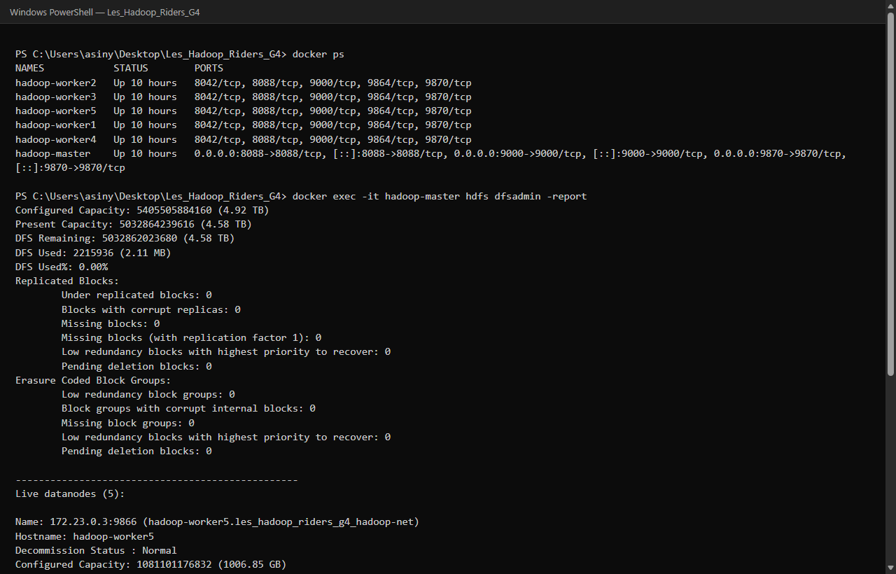
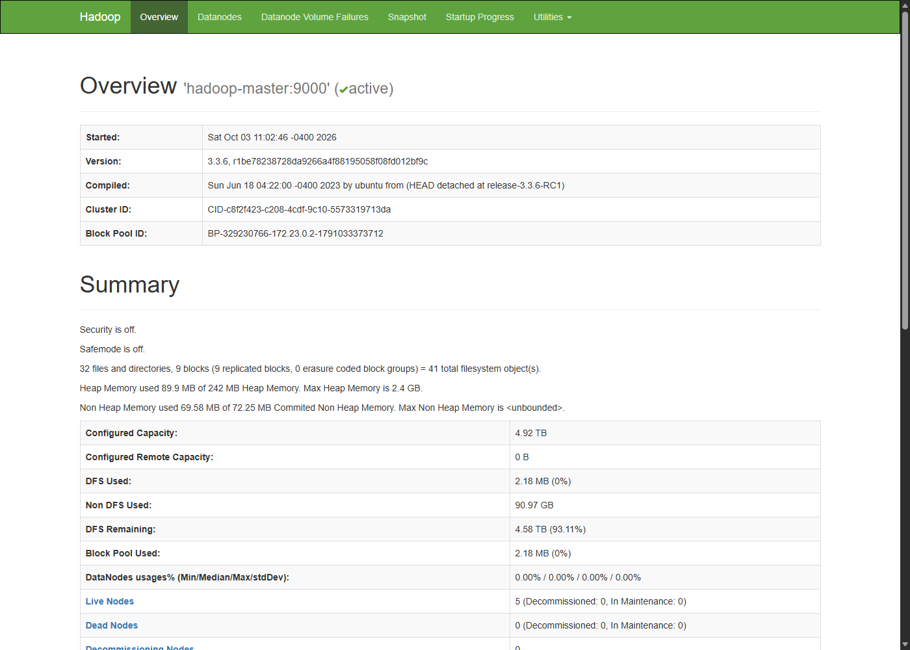
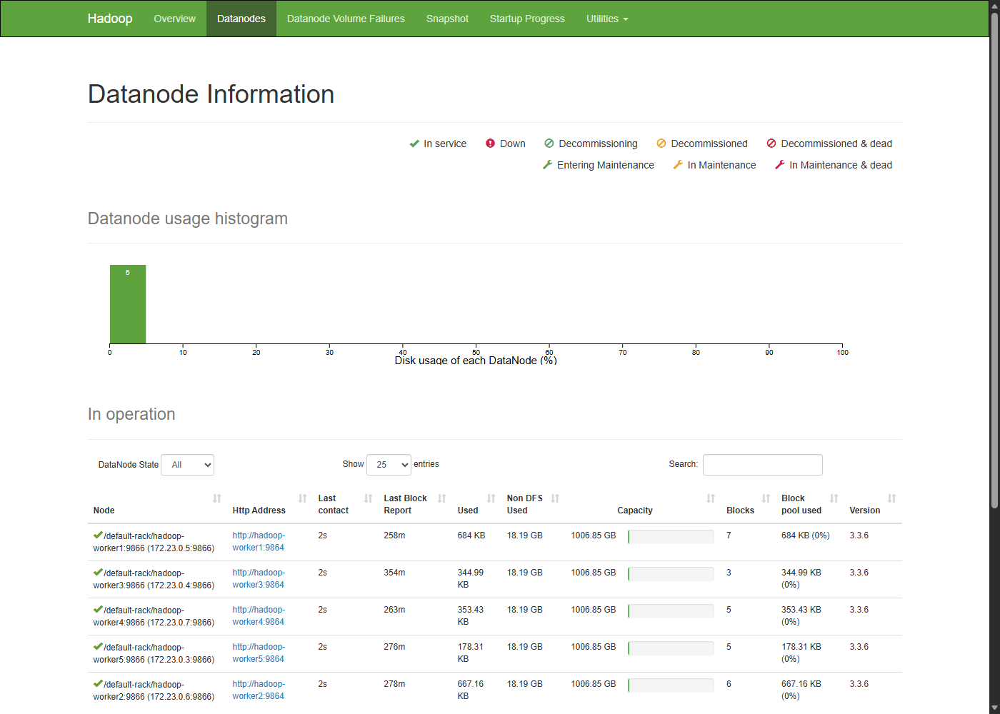
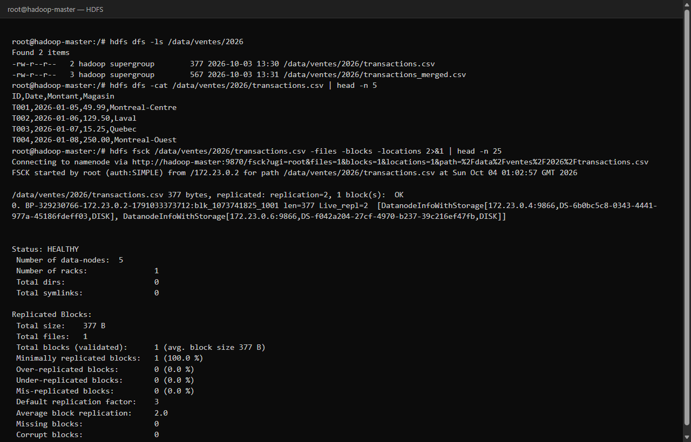
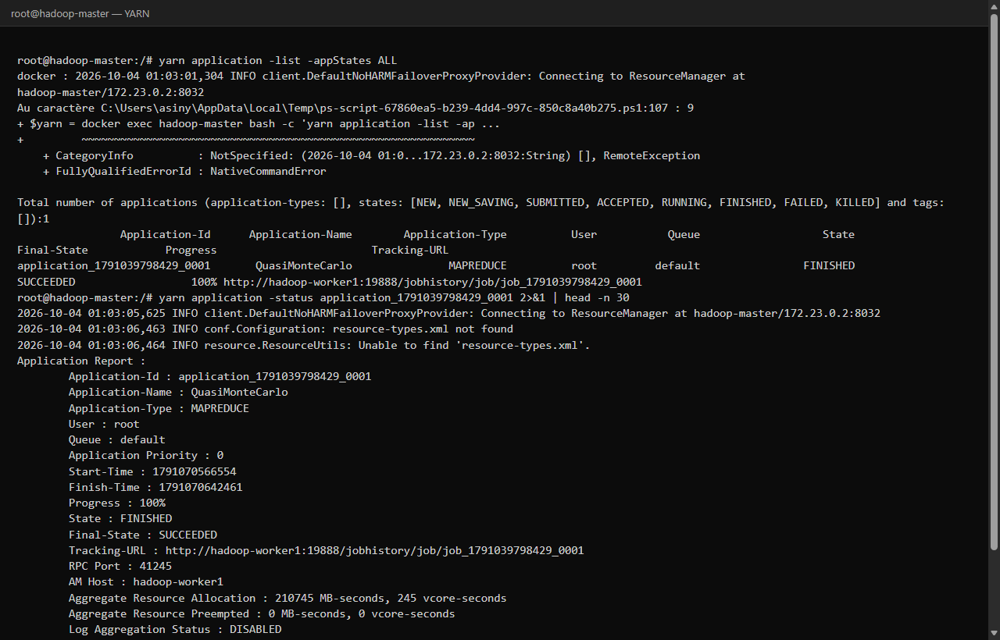
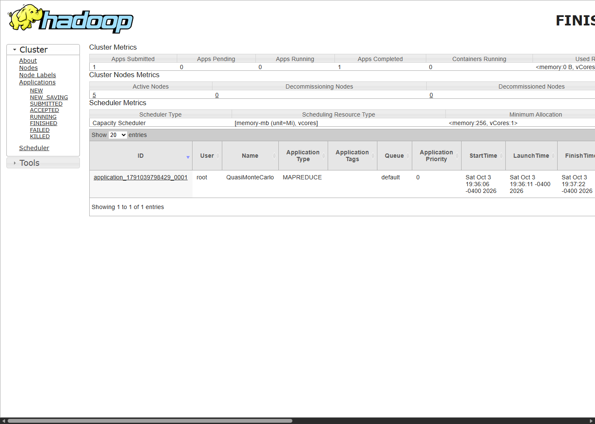
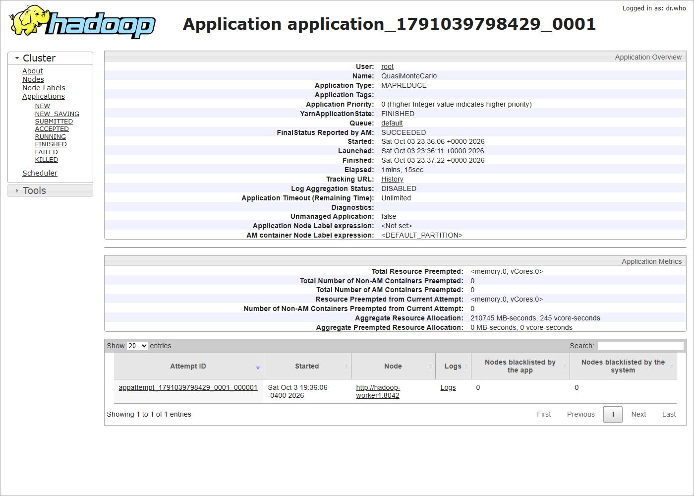

# Projet 1 — Déploiement et Exploitation d'un Cluster Hadoop avec Docker

**Cours :** Bases de données massives avancées (IFM30522)  
**Groupe :** G4 — Les_Hadoop_Riders  

| Étudiant | |
|----------|--|
| Komla Petro Asinyo | Kassoum Dene |
| Joel Kazoni Tugirimana | Forbes Magène |
| Frank A Simo Ngounou | Wren Surprenant-Nicolson |

**Docker Hub :** https://hub.docker.com/r/leshadoopriders/hadoop-tp-g4  
**Image :** `leshadoopriders/hadoop-tp-g4:1.0`  
**Code source :** https://github.com/asinyopetro/Les_Hadoop_Riders_G4  

---

## Partie 1 — Contexte théorique et architecture (5 pts)

### 1. Cas d'usage Big Data (1.5 pt)

Nous avons choisi le secteur de l’**e-commerce**.

Exemple : une chaîne de magasins qui garde les tickets de caisse, les logs du site et les mouvements de stock. Chaque jour le volume grossit, les données arrivent souvent, et les formats changent (CSV, JSON, texte, images produits).

Les **3V** dans ce cas :

- **Volume** : beaucoup d’événements, historique sur plusieurs années.
- **Vélocité** : commandes et paiements en continu ; il faut pouvoir réagir vite (fraude, rupture de stock).
- **Variété** : tables, logs, parfois des médias.

HDFS sert au stockage distribué. YARN sert à lancer les jobs (MapReduce, etc.) sur le cluster.

### 2. HDFS vs système de fichiers classique (1.5 pt)

Sur un système de fichiers classique (ext4, NTFS), un fichier vit sur **une** machine. C’est l’OS local qui gère les métadonnées et le contenu.

Avec **HDFS**, le fichier est coupé en **blocs**. Les blocs sont placés et **répliqués** sur plusieurs DataNodes. Le **NameNode** garde le namespace (noms, dossiers, où sont les blocs).

En pratique : le FS local est centralisé ; HDFS est distribué et plus tolérant aux pannes grâce à la réplication.

### 3. Rôle de YARN — ResourceManager et NodeManager (2 pts)

Quand on soumet une application :

- Le **ResourceManager** (master) reçoit la demande, voit les ressources du cluster et alloue des conteneurs. Il lance aussi l’ApplicationMaster.
- Le **NodeManager** (chaque worker) démarre et surveille les conteneurs **sur son nœud**, puis remonte l’état au ResourceManager.

Donc : le ResourceManager orchestre ; le NodeManager exécute sur la machine.

---

## Partie 2 — Déploiement et manipulation pratique (15 pts)

### A. Mise en place de l'environnement Docker (4 pts)

#### 1. Déploiement NameNode + 5 DataNodes (1.5 pt)

Nous avons déployé six conteneurs :

- `hadoop-master` : NameNode, ResourceManager, SecondaryNameNode  
- `hadoop-worker1` à `hadoop-worker5` : DataNode + NodeManager  

Réseau Docker : `hadoop-net`  
Ports exposés : **9870** (UI HDFS), **8088** (UI YARN), **9000** (HDFS RPC)

```bash
docker compose up --build -d
docker ps
```



#### 2. Vérification des DataNodes (1.5 pt)

```bash
docker exec -it hadoop-master hdfs dfsadmin -report
```

Résultat observé : **Live datanodes (5)**.  
Interface NameNode : http://localhost:9870





#### 3. Publication de l'image (1 pt)

```bash
docker login
docker push leshadoopriders/hadoop-tp-g4:1.0
```

**URL publique :** https://hub.docker.com/r/leshadoopriders/hadoop-tp-g4  

(Note : Docker Hub impose les minuscules, d’où `g4` plutôt que `G4`.)

---

### B. Manipulation avancée sur HDFS (6 pts)

#### 4. Répertoires et droits (2 pts)

Fichier local créé : `data/transactions.csv` (colonnes ID, Date, Montant, Magasin — 10 lignes).

```bash
hdfs dfs -mkdir -p /data/ventes/2026
hdfs dfs -chmod 755 /data/ventes/2026
hdfs dfs -put -f /data/transactions.csv /data/ventes/2026/
hdfs dfs -chmod 644 /data/ventes/2026/transactions.csv
```

#### 5. Transfert et vérification des blocs (2 pts)

```bash
hdfs fsck /data/ventes/2026/transactions.csv -files -blocks -locations
hdfs dfs -stat "%n | taille=%b | replication=%r | block_size=%o" /data/ventes/2026/transactions.csv
```

Résultats :
- taille : 377 octets  
- réplication initiale : 3  
- 1 bloc (fichier petit ; taille de bloc par défaut 128 Mo)  
- état FSCK : HEALTHY  



#### 6. Lecture et concaténation (1 pt)

```bash
hdfs dfs -cat /data/ventes/2026/transactions.csv | head -n 5
hdfs dfs -put -f /data/transactions_part2.csv /data/ventes/2026/
hdfs dfs -getmerge /data/ventes/2026 /tmp/transactions_merged.csv
hdfs dfs -put -f /tmp/transactions_merged.csv /data/ventes/2026/transactions_merged.csv
```

Les 5 premières lignes sont lues directement depuis HDFS. Les deux fichiers ont été fusionnés via `getmerge`.

#### 7. Suppression / corbeille (1 pt)

```bash
hdfs dfs -rm /data/ventes/2026/transactions_part2.csv
hdfs dfs -D fs.trash.interval=10080 -rm /data/ventes/2026/to_delete.csv
hdfs dfs -ls -R /user/hadoop/.Trash
# suppression définitive :
# hdfs dfs -rm -skipTrash /chemin/fichier
```

Sans `fs.trash.interval`, la suppression peut être définitive. Avec un intervalle > 0, le fichier passe dans `.Trash`. L’option `-skipTrash` force la suppression définitive.

---

### C. Exécution d'un job YARN (5 pts)

Exemple choisi : **calcul de π** (Monte Carlo).

```bash
yarn jar $HADOOP_HOME/share/hadoop/mapreduce/hadoop-mapreduce-examples-3.3.6.jar pi 4 1000
```

Résultat :
- Application : `application_1791039798429_0001`  
- Nom : QuasiMonteCarlo  
- État final : **SUCCEEDED**  
- Estimation de π ≈ 3.14  







---

## Partie 3 — Administration, monitoring et analyse (10 pts)

### 1. Interfaces web (4 pts)

**NameNode (http://localhost:9870)**  
On voit bien les 5 DataNodes. L’espace DFS utilisé est faible (labo). Pas de missing block pendant nos tests.

**YARN (http://localhost:8088)**  
Le job pi est en **FINISHED / SUCCEEDED**. On voit aussi la mémoire et le temps d’exécution (environ 198589 MB-seconds et 216 vcore-seconds sur un des runs).

### 2. Facteur de réplication (3 pts)

```bash
hdfs dfs -setrep -w 2 /data/ventes/2026/transactions.csv
```

Après la commande, la réplication passe à **2**.  
Le NameNode change la cible. Comme on passe de 3 à 2, une copie en trop est retirée. L’option `-w` attend que ce soit terminé.

### 3. Retour d'expérience / troubleshooting (3 pts)

**Problème 1 — pull Docker Hub avant le build**  
Symptôme : `pull access denied` pour l’image du groupe.  
Cause : Compose tentait de télécharger une image pas encore publiée.  
Solution : `pull_policy: never` et build local de l’image.

**Problème 2 — majuscules dans le tag**  
Symptôme : `repository name must be lowercase`.  
Solution : tag final `leshadoopriders/hadoop-tp-g4:1.0`.

**Problème 3 — téléchargement Hadoop trop lent**  
Symptôme : build bloqué longtemps sur archive.apache.org.  
Solution : image de base `apache/hadoop:3.3.6` + nos fichiers de configuration et `entrypoint.sh`.

---

## Annexes

### Structure du code source

```text
Les_Hadoop_Riders_G4/
├── Dockerfile
├── docker-compose.yml
├── entrypoint.sh
├── config/
│   ├── core-site.xml
│   ├── hdfs-site.xml
│   ├── yarn-site.xml
│   ├── mapred-site.xml
│   └── workers
├── data/
│   ├── transactions.csv
│   └── transactions_part2.csv
├── scripts/
│   ├── demo-hdfs.sh
│   └── demo-yarn-pi.sh
├── captures/
└── README.md
```

### Lien Docker Hub

https://hub.docker.com/r/leshadoopriders/hadoop-tp-g4
